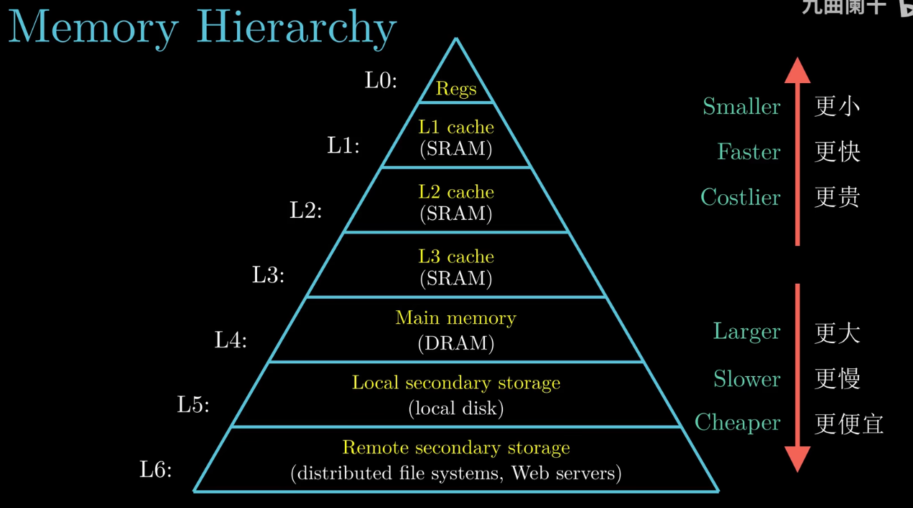
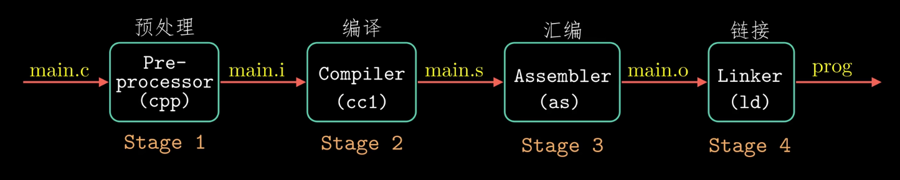
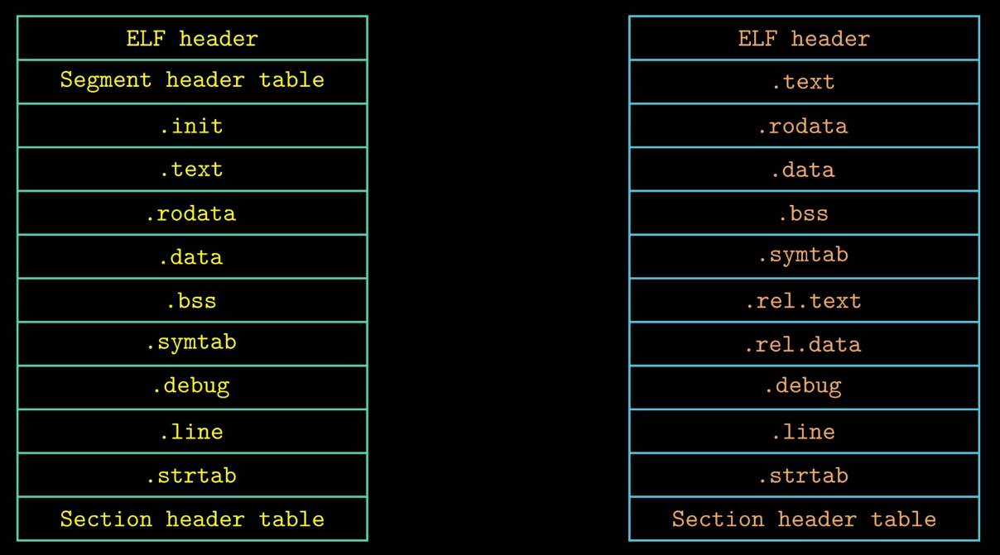
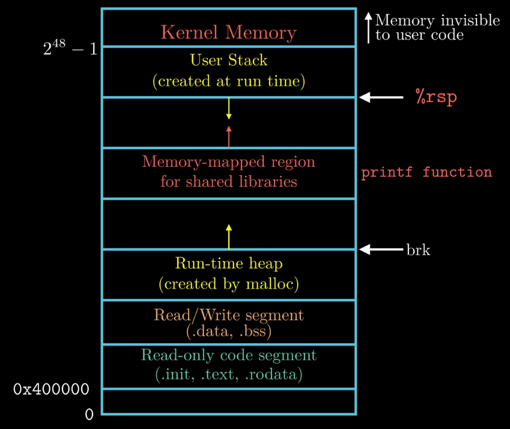
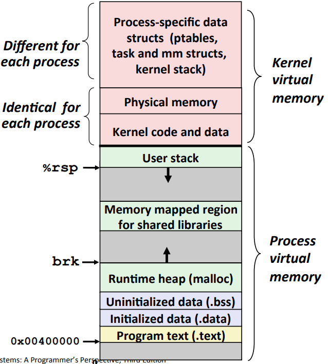

# CSAPP Notes

## Representing and Manipulating Information
### Bits, Bytes, and Integer
each bit is 0 or 1  
exclusive-or(Xor): A ^ B = 1 when either A = 1 or B = 1, but not A = B = 1  
representing & manipulating sets  
p && \*p (avoids null pointer access)(char*)  
Shift options: logical shift, arithmetic shift  

unsigned: $B2U(X)=\sum_{i=0}^{w-1} x_i⋅2^i$  
UMin=0, UMax=$2^w-1$  
Two's complement: $B2T(X)=-x_{w-1}⋅2^{w-1}+\sum_{i=0}^{w-2} x_i⋅2^i$  
TMin=$-2^{w-1}$, TMax=$2^{w-1}-1$  
observations: $|TMin|=TMax+1, UMax=2TMax+1$  

signed and unsigned evaluation: signed value implictly cast to unsigned
```
// print -128
char a = -128;
a=-a;
printf("%d\n", a);
```
sign extension: $X'=x_{w-1},...,x_{w-1},x_{w-1},x_{w-2},...,x_{0}$  

truncating: 11000(24) =>(mod $2^4$) 1000(8)  
unsigned addition: $UAdd_w(u,v)=u+v\ mod\ 2^w$  
unsigned multiplication: $UMult_w(u,v)=u⋅v\ mod\ 2^w$  
multiply with shift: `u << k` gives u * $2^k$  
for unsigned: `u >> k` gives ⌊u / $2^k$⌋  
for minus signed: ⌊u / $2^k$⌋ gives `u >> k` if u % 2 == 0, else `(u + 1) >> k`  
signed x, -x = ~x + 1  
data type `size_t` defined as unsigned value with length = word size
```
size_t i;
for (i = cnt - 2; i < cnt; i--)
    a[i] += a[i + 1];
```
byte ordering: big endian, small endian(x86)  
### floating point
rational number: $\sum_{k=-j}^ib^k\ 2^k$, only can represent $\frac{x}{2^k}$  
floating point: $(-1)^sM2^E$  
rounding: towards zero, round up, round down, nearest even(default)  
FP multiplication: $(-1)^{s1}M1\ 2^{E1}$ * $(-1)^{s2}M2\ 2^{E2}$ => $(-1)^sM2^E$  
s = s1 ^ s2, M = M1 * M2, E = E1 + E2  
associative(x)  

## Machine-Level Representation of Programs
complex instruction set computer(CISC)  
reduced instruction set computer(RISC)  
gcc -Og -S main.c  
data type:  
'integer' data of 1, 2, 4, or 8 bytes: data values, addresses  
floating data of 4, 8, or 10 bytes  
objdump gdb  
%r(64 bits), %e(32 bits)  
%rsp(stack pointer)  
movq source, dest, but movq mem mem is wrong  
memory addressing: D(Rb, Ri, S) => Mem[Reg[Rb] + S * Reg[Ri] + D]  
leaq src, dest(src is address mode expression)  
uses: `p = &x[i]`, `x + k * y`

%rip(instruction pointer)  
status of recent tests(CF, ZF, SF, OF)  
CF: carry flag(for unsigned)  
SF: sign flag(for signed)  
ZF: zero flag  
OF: overflow flag(for signed)  

cmpq src2,src1 like computing src1 - src2 without setting destination, and setting the flag  
testq src2,src1 like computing src1 & src2 without setting destination, and setting the flag  
movzbl(clear high order bits)  

(trick)if `x > 6 && x < 0`, `(unsigned)x > 6`  
switch: create jump table, or transform to if-else

rep; ret: just for processor to run fast

ABI(application binary interface)  
call: push + jmp  
ret: pop + jmp  

for integers and pointers:  
argument: %rdi %rsi %rdx %rcx %r8 %r9, other: stack  
instruction pointer: %rip  
return value: %rax  

caller frame: save local variable, arguments for callee frame and return address  
callee frame: save old %rbp(optional), registers states and local variable  

caller save: %rax, %rdi,...,%r9, %r10, %r11  
callee save: %rbx, %r12, %r13, %r14, %rbp, %rsp  

`A[i]` address `A + i * (C * K)`  
`A[i][j]` address `A + i * (C * K) + j * K`  
alignment  
for largest alignment requirement K, overall structure must be multiple of K  
saving space: put large data types first  

XMM registers: 128 bits  
addss, addps, addsd  
return value: %xmm0

x86 linux memory layout:  
- stack
- heap
- data
- text/shared libraries

memory allocation in heap of two side, low and high address

buffer overflow attack:  
- code injection attacks
- return-oriented programming attacks(ROP)

buffer overflow attacks solutions:  
- avoid overflow
- system-level protection
    - address-space layout randomization(ASLR)
    - nonexecutable code segments
- stack canaries: place special value beyond the buffer; gcc: -fno-stack-protector(now default) %fs:...

union
- allocate according to largest element
- can only use one field at a time

## Program Optimization
writing an efficient program
- select appropriate algorithms and data structures
- capabilities and limitations of optimazing compilers
- exploiting parallelism

optimize methods:  
reduce frequency  
replace costly operation with simpler one  
reuse portions of expression  
procedure calls  
removing aliasing  

cycles per element(CPE)  

for integer, loop unrolling with
- reassociated computation
- separate accumulators

for float, YMM registers  
branch prediction through loop

performance limitation:  
- latency bound
- throughput bound

superscalar processor pipeline

data-flow flow

loop unrolling  
accumulator  
reassociation transformation

other limitations:  
register spilling  
misprediction penalty

load performance  
store performance

tools: gprof

## The Memory Hierarchy
random-access memory(RAM)(volatile memorys)
- SRAM
- DRAM

nonvolatile memorys
- ROM
- PROM
- EPROM
- EEPROM

I/O bus

disk  
$T_{access}=T_{seek}+T_{rotation}+T_{transfer}$

SSD:  
flash chip-die-plane-block-page



## Cache Memories
locality
- temporal locality
- spatial locality

cache hit/miss
- code miss
- conflict miss
- capacity miss

cache-set-line-[valid(1 bit), tag, block(B bytes)]  
address: Tag + Set index + Block index  
capacity: C = E * B * S

- set selection
- line matching
- word extraction

cache structure
- direct-mapped cache
- set associative cache
    - choose the line to replaced at random
    - least frequently used(LFU)
    - least recently used(LRU)
- full associative cache

write hit
- write-through
- write-back

write miss
- write-allocate
- no-write-allocate

## Linking


symbol resolution  
relocation

object file
- relocatable object file(*.o)
- executable object file(a.out)
- shared object file(*.so)

executable and linkable format(ELF)

executable ELF vs. relocatable ELF


linker symbols
- global symbols
- external symbols
- local symbols(static)

program symbols
- strong: procedures and initialized globals
- weak: uninitialized globals

linker's symbol rules:
- multiple strong symbols are not allowd
- given a strong symbol and multiple weak symbols, choose the strong symbol
- if there are multiple weak symbols, pick an arbitrary one(can override this with gcc -fno-common)

relocation entries(in .rel.text/data)



static libraries(.a archive files)(old)  
problem: order matters

3 sets for relocation: E, U, D

shared libraries(.so)(modern)

library interpositioning
- compile time(use #define)
- link time(-Wl,--wrap,func)
- load/run time(LD_PRELOAD)

## Exceptional Control Flow(ECF)
the sequence of instructions is CPU's control flow

ECF exists at all levels of a computer system  
low level:
- exception

higher level:
- process context switch
- signals
- nonlocal jumps

exceptions: a transfer of control to the OS kernel in response to some event
- asynchronous exceptions(interrupts)  
example: timer, I/O interrupt
- synchronous exceptions
    - traps  
    example: system calls, breakpoint traps,special instructions
    - faults  
    example: page faults, protection faults, floating point exceptions
    - aborts  
    example: illegal instruction, parity error, machine check

`syscall` instruction

processes: an instance of a running program  
provides 2 abstractions:
- logical control flow
- private address space

state(programmer perspective):
- running
- stopped(SIGSTOP, SIGTSTP, SIGTTIN, SIGTTOU)
- terminated
    - receiving a signal
    - returning from the main routine
    - calling the exit function

concurrent processes

context switching
- saves the context of the current process
- restores the saved context of some previously preempted process
- passes control to this newly restored process

obtaining process id  
`pid_t getpid(void)`  
`pid_t getppid(void)`

terminating processes  
`void exit(int status)`

creating processes  
`pid_t fork(void)` from `sys/tpyes.h, unistd.h`  
call once, return twice

reaping child processes  
"zombie"

synchronizing with children  
`int wait(int *child_status)`  
`pid_t waitpid(pid_t pid, int &status, int options)`

loading and running programs  
`int execve(char *filename, char *argv[], char *envp[])`

signals: a small message that notifies a process that an event of some type has occurred in the system  
sending
- with the /bin/kill program
- from the keyboard
- with the kill function
- with the alarm function

receiving
- terminate
- terminate and dump core
- suspends until restarted by a SIGCONT signal
- ignore

pending and blocking signal

process groups  
`pid_t getpgrp(void)`  
`pid_t setpgrp(pid_t pid, pid_t pgid)`

installing signal handlers  
`handler_t *signal(int signum, handler_t *handler)`

writing safe handlers
- keep your handlers as simple as possible
- call only async-signal-safe functions in your handlers
- save and restore `errno` on entry and exit
- protect accesses to shared data structures by temporarily blocking all signals
- declare global variables as `volatile`
- declare global flags as `volatile sig_atomic_t`

async-signal-safety

## System-Level I/O
unix I/O  

file types
- regular file
- directory
- socket
- named pipes(FIFOs)
- symbolic links
- character and block devices

end of line(EOL) indicators in other systems
- linux and mac os: '\n'(0xa)
- windows and internet protocals: '\r\n'(0xd 0xa)

file descriptor(int)  
stdin(0), stdout(1), stderr(2)

opening files  
`int open(char *filename, int flags, mode_t mode)`

closing files  
`int close(int fd)`

reading files  
`ssize_t read(int fd, void *buf, size_t n)`

writing files  
`ssize_t write(int fd, const void *buf, size_t n)`

RIO package  
`ssize_t rio_readn(int fd, void *usrbuf, size_t n)`  
`ssize_t rio_writen(int fd, void *usrbuf, size_t n)`  
`void rio_readinitb(rio_t *rp, int fd)`  
`ssize_t rio_readlineb(rio_t *rp, void *usrbuf, size_t maxlen)`  
`ssize_t rio_readnb(rio_t *rp, void *usrbuf, size_t n)`

file metadata  
`int stat(const char *filename, struct stat *buf)`  
`int fstat(int fd, struct stat *buf)`

read directory  
`DIR *opendir(const char *name)`  
`struct dirent *readdir(DIR *dirp)`  
`int closedir(DIR *dirp)`

unix kernel represents open files:
- descriptor table
- open file table
- v-node table

I/O redirection  
`int dup2(int oldfd, int newfd)`

standard I/O functions

printf need `'\n'` or `int fflush(FILE *stream)`

## Virtual Memory
- uses main memory efficiently
- simplifies memory management
- isolates address spaces

physical addressing  
virtual addressing

memory management unit(MMU)

virtual page(VP)  
physical page(PP)

page table is a array of page table entries(PTE)

page hit  
page fault

address translation:  
MAP: $VAS\rightarrow PAS\cup \varnothing$  

translation lookaside buffer(TLB): cache of PPN of PTEs

multi-level page tables: save memory



linux organizes VM as collection of areas

memory mapping: VM->object in disk
- regular file
- anonymous file(demand-zero page)

shared objects  
private copy-on-write(COW) objects

user-level memory mapping  
`void *mmap(void *start, size_t length, int prot, int flags, int fd, off_t offset)`  
`int munmap(void *start, size_t length)`

## Storage Allocation
dynamic memory allocation

top of heap(brk pointer)

allocators
- explicit allocator
- implicit allocator

`void *malloc(size_t size)`  
`void free(void *p)`

`void *sbrk(intptr_t incr)`

allocator performance:  
- throughput  
- peak memory utilization  
$U_k=\frac{max_{i\leq k}P_i}{H_k}$

fragmentation
- internal fragmentation
- external fragmentation

implicit list  
placement policy
- first fit
- next fit
- best fit

coalescing
- immediate coalescing
- deferred coalescing

bidirectional coalescing: add boundary tags

explicit free list  
insertion policy
- LIFO
- address-ordered

segregated free list
- simple segregated storage
- segregated fit
- buddy system

garbage collection  
classical GC algorithms
- Mark-and-sweep collection
- reference counting
- copying collection
- generational collectors


reflexion:  
dont use signed data types overflow  
Virtual Address Space  
timestamp may be a trouble(1s)
